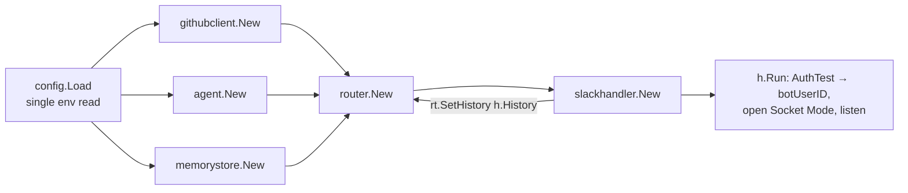
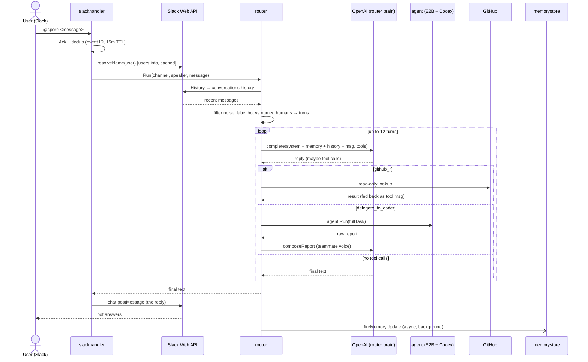
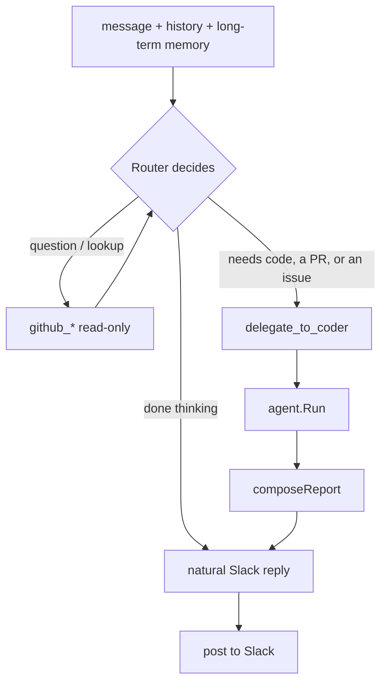
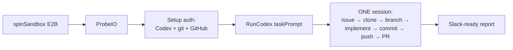
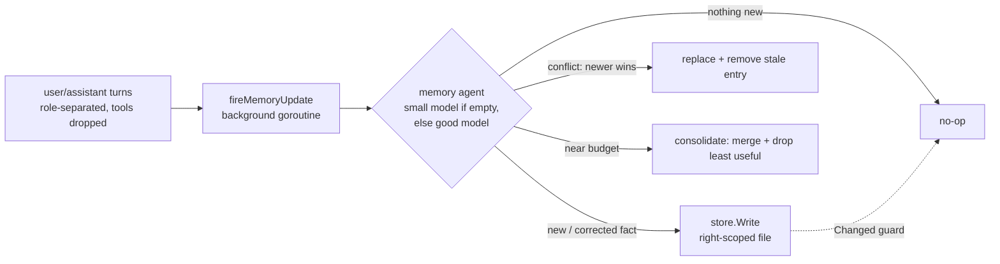

# Spore — runtime architecture & flow

How the bot actually works at runtime, end to end. Companion to
[`flow.md`](./flow.md) (the Slack install runbook). Diagrams are Mermaid — they
render on GitHub and in most IDEs.

---

## 1. Startup wiring (`main.go`)

Everything is assembled once at boot, then the Slack-backed history provider is
injected into the router (so the router holds **no** conversation state itself).

All environment variables are read in exactly one place: `config.Load()`
(`config/config.go`), which also loads `.env` and resolves fallback chains
(`ROUTER_MODEL`→`OPENAI_MODEL`, `GITHUB_TOKEN`→`GH_TOKEN`, Codex auth file
lookup, LangSmith on/off). Every other package receives values from the
`Config` struct.

LangSmith tracing is two-layered: chain/tool runs (router turn, memory update,
tool dispatch) are OTel spans opened by `langsmith.Tracer.Start`; **LLM runs
are traced at the HTTP layer** by the official `traceopenai` middleware
(`langsmith.WrapHTTPClient` wraps langchaingo's HTTP client), so messages,
tool calls, and token usage are mapped by LangSmith's own code and nest under
whatever span is in `ctx`.

---

## 2. A message, end to end (the main path)

The handler guarantees **exactly one** reply per job (success, error, timeout,
or panic), gated by a 2-job semaphore and a 15-minute budget + watchdog.

---

## 3. What the router brain decides

---

## 4. Inside `delegate_to_coder` → `agent.Run` (one Codex session)

A single Codex session owns the whole job; the Go side is just the harness that
stands up an authenticated sandbox and relays the result.

---

## 5. State & memory layers (what survives what)

| Layer | Where | Scope | Survives redeploy? |
|-------|-------|-------|--------------------|
| Event dedup | `seen` map | event ID, 15m TTL | No (fine — short-lived) |
| **Conversation history** | fetched from **Slack** live | per channel, named, **no timestamps** | ✅ Yes (Slack is source of truth) |
| Per-request transcript | `messages` slice | one request | discarded after reply |
| **Long-term memory** | `memorystore` files | scoped: USER / STACK / REPOS / SKILLS (+ optional COMPANY / PRODUCT) | ⚠️ Only if `MEMORY_DIR` is a persistent volume |

Memory files by scope:

| File | Holds |
|------|-------|
| `USER.md` | who the user is + how they like to work (identity, prefs, comms style) |
| `STACK.md` | cross-project stack & tooling preferences |
| `REPOS/<owner>-<repo>.md` | facts/preferences true for **one** repo only |
| `SKILLS/<topic>.md` | durable skills/lessons not tied to a repo |
| `COMPANY.md` / `PRODUCT.md` | optional; solo users may skip |

Injection is **bounded**: `PromptBlock` renders files in priority order up to a
char budget (`promptInjectionBudget`) and omits the rest (kept on disk), so
memory can never bloat the context. The maintenance agent instead reads the
uncapped `FullBlock` so it can consolidate across everything.

### Post-run memory update (async)

Files are created **lazily** — only real content is written, so a solo user
never accumulates empty `COMPANY.md` / `PRODUCT.md`. The prompt makes the agent
scope facts correctly, resolve conflicts by **superseding** (newer wins, stale
entry removed), and **consolidate** when a file nears its budget. The `Changed`
guard skips rewrites when nothing meaningful changed.

---

## 6. Entry points

- **App mention** (`@spore …`) → `handleMention` → the flow above.
- **`/issue` slash command** → currently **disabled** (commented out in
  `slackhandler`). Re-enable by uncommenting the `SlashCommand` case in `Run`
  and `handleCommand`'s body.
- **CLI one-shot** (`AGENT_PROMPT` set) → `runOnce` → same `router.Run`, speaker
  `"You"`, no Slack history, exits after one task.

---

## 7. Key design choices (and their trade-offs)

- **Single Codex session for coding** — one call does issue→PR→report. Simpler,
  but Go no longer enforces branch/commit/PR formatting, a build-validation retry
  loop, or per-step partial-progress recovery; the session owns correctness.
- **Slack-backed conversation history** — stateless, redeploy-proof, and labeled
  by display name so the model tracks who said what in a shared channel. Costs
  one extra Slack API call per message; per-channel (not per-thread); no
  timestamps are passed.
- **Long-term memory on local disk** — persists across sessions, but **not**
  across redeploys unless `MEMORY_DIR` is a mounted volume (or moved to S3).
- **Router owns GitHub reads; agent owns all writes (code, PRs, issues)** —
  cheap, deterministic lookups stay in Go; anything that changes GitHub state
  goes through the sandboxed coding agent.
