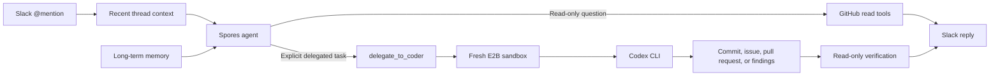

<div align="center">
  

  # Spores

  **A Slack-native AI teammate that reads repositories, delegates coding and research work, and verifies the result.**

  [Portfolio](https://hetsaraiya.com/projects/spores) ·
  [OpenAI Gateway](https://github.com/hetsaraiya/openai-gateway)
</div>

## Overview

Spores turns a Slack `@mention` into a GitHub-aware agent. It can answer
questions with read-only repository tools, or hand an explicitly requested code
change or a pure research task to Codex inside a fresh E2B sandbox. The same
delegation pipeline can search the web and work without a repository or GitHub
credentials. After repository work finishes, Spores uses its read-only GitHub
tools to verify the result before replying in Slack.

The project is deliberately split into two trust zones:

- The conversational agent can inspect repositories but cannot change them.
- The coding agent can make changes only inside a short-lived, credential-scoped
  sandbox.

Spores is also the project that motivated
[OpenAI Gateway](https://github.com/hetsaraiya/openai-gateway). The gateway
gives disposable Codex sandboxes one stable OpenAI-compatible endpoint backed
by subscription credentials.

## How it works



Only one delegation is allowed per request. That constraint keeps the
front agent responsible for evaluating the outcome instead of repeatedly
triggering a write-capable process.

## Features

- Slack Socket Mode integration with display-name resolution, recent
  conversation history, image understanding, and emoji reactions with reactor
  names.
- Read-only GitHub tools for repositories, files, issues, and code search.
- Jina Reader and Search tools for clean URL extraction and web search.
- A single handoff to Codex for repository-backed coding or repository-free research.
- Post-delegation verification using only the restricted GitHub tool surface.
- Persistent Markdown memory with focused search and asynchronous curation.
- Owner-only access to private long-term memory.
- An optional authenticated portal for reviewing and editing memory files.
- A `PROMPT` CLI mode that runs the same agent without Slack.
- Graceful shutdown that drains queued memory updates before exit.

## Technology

| Area | Technology |
| --- | --- |
| Runtime | Go 1.26 |
| Model client | `openai-go` chat completions and tool calling |
| Chat surface | `slack-go` with Socket Mode |
| Repository access | GitHub REST API |
| Coding isolation | E2B sandboxes |
| Coding agent | OpenAI Codex CLI |
| Deployment | Docker |

## Repository layout

```text
.
├── internal/agent/          Agent loop and tool orchestration
├── internal/coder/          E2B sandbox and Codex delegation
├── internal/github/         Read-only GitHub client
├── internal/memory/         Persistent memory, search, and curation
├── internal/portal/         Authenticated memory editor
├── internal/slackhandler/   Slack Socket Mode adapter
├── internal/tools/          Tool definitions and dispatch
├── memory/                  Markdown memory files
└── main.go                  Slack, portal, and CLI entry point
```

## Prerequisites

- Go 1.26 or newer
- A Slack app configured for Socket Mode
  - Bot scopes: `app_mentions:read`, `chat:write`, `files:read`,
    `reactions:read`, `users:read`, plus the appropriate conversation-history
    scopes for the channel types where the bot runs
  - App-level scope: `connections:write`
- An OpenAI-compatible chat-completions endpoint
- A GitHub token for repository reads
- E2B and Codex credentials if coding delegation is enabled

## Configuration

Spores loads a local `.env` file when present and otherwise reads the process
environment.

| Variable | Required | Default | Purpose |
| --- | --- | --- | --- |
| `OPENAI_API_KEY` | Yes | none | Key for the configured model endpoint |
| `OPENAI_BASE_URL` | No | `https://api.openai.com/v1` | OpenAI-compatible base URL |
| `MODEL` | No | `gpt-5.5` | Front-agent model |
| `GITHUB_TOKEN` | No | none | Read access for the front agent and repository access for delegated tasks; delegation can run without it when repository access is unnecessary |
| `JINA_API_KEY` | For Jina Search | none | Jina API key; Reader can run without one at a lower rate limit |
| `SLACK_BOT_TOKEN` | For Slack mode | none | Slack bot token |
| `SLACK_APP_TOKEN` | For Slack mode | none | Slack Socket Mode app token |
| `E2B_API_KEY` | For delegation | none | E2B API key |
| `E2B_TEMPLATE_ID` | For delegation | none | Sandbox template to launch |
| `CODEX_MODEL` | For delegation | none | Model used by Codex CLI |
| `CODEX_VERSION` | Recommended | none | Pins the `@openai/codex` release installed in the sandbox; unset installs the current one |
| `CODEX_AUTH_JSON` | For delegation | none | Codex login JSON injected into the sandbox |
| `MEMORY_DIR` | No | `./memory` | Persistent memory directory |
| `OWNER_SLACK_USER_ID` | Recommended | none | Slack user allowed to search memory and write `USER.md`. Both fail closed when unset |
| `MEMORY_UPDATE_MODE` | No | `always` | `always` or `off`; any other value is rejected at startup |
| `PORTAL_ENABLED` | No | `false` | Enable the memory editor |
| `PORTAL_ADDR` | No | `:8080` | Memory portal listen address |
| `PORTAL_TOKEN` | With portal | none | Bearer token required by portal APIs |

Never commit real values for tokens or credential JSON.

## Run locally

Install dependencies:

```bash
go mod download
```

Run a single request through the CLI path:

```bash
PROMPT="Summarize the open issues in hetsaraiya/spores" go run .
```

Run the Slack bot:

```bash
go run .
```

Run the test suite:

```bash
go test ./...
```

## Docker

```bash
docker build -t spores .
docker run --env-file .env spores
```

Mount `MEMORY_DIR` as a persistent writable volume in production. Otherwise,
the agent's long-term memory will reset when the container is replaced.

## Security model

- GitHub tools available to the conversational agent are read-only.
- Write access is isolated in a disposable E2B environment.
- Sandbox credentials should be short-lived and limited to the target task.
- The memory portal fails closed unless a bearer token is configured.
- Portal credentials belong in the `Authorization` header, never in a URL.
- Codex login JSON, Slack tokens, GitHub tokens, and `.env` files must remain
  outside version control.

## License

Copyright © 2026 Het Saraiya. All rights reserved.

This repository is **source-available, not open source**. The included
[license](./LICENSE) permits personal, non-commercial evaluation of unmodified
copies only. Commercial use, modification, derivative works, and redistribution
are prohibited without prior written permission.
